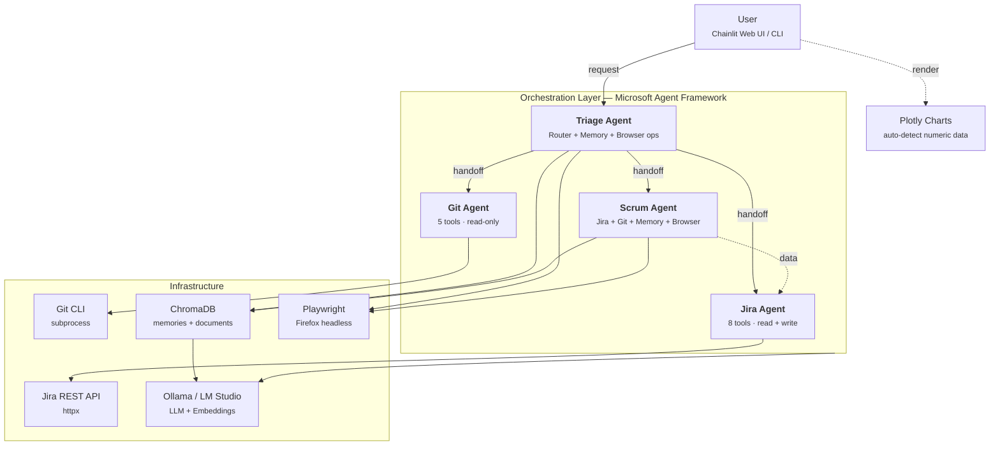

# Pile

**Local-first Scrum Master assistant** — quản lý sprint, phân tích team performance, tư vấn Agile methodology. Chạy hoàn toàn trên máy nội bộ, không gửi data ra cloud.

Built on [Microsoft Agent Framework](https://github.com/microsoft/agent-framework) · LLM via [Ollama](https://ollama.com) / [LM Studio](https://lmstudio.ai) · UI via [Chainlit](https://chainlit.io)

---

## Highlights

| | Feature | Detail |
|---|---|---|
| **Jira** | Read + Write | Search, CRUD issues, sprint tracking, board view. Write ops require user approval |
| **Git** | Read-only | Commit history, branches, diffs, blame. Private repo support |
| **Scrum** | 17 capabilities | Standup, sprint review, retro, workload balance, cycle time, data quality audit, delay alerts, stakeholder summary... |
| **Memory** | Remember & Forget | Long-term memory across sessions. Semantic search via ChromaDB + Ollama embeddings |
| **Knowledge** | RAG | Ingest PDF/markdown → chunk → embed → query. Feed whitepapers, meeting notes, process docs |
| **Browser** | Web Scraping | Playwright + Firefox. Auto-login Jira/GitHub/GitLab. Persistent sessions |
| **Charts** | Auto-visualization | Detect numeric data in responses → render interactive Plotly charts |
| **Bilingual** | VI + EN | Auto-detect ngôn ngữ, trả lời cùng ngôn ngữ |

---

## Quick Start

```bash
git clone git@github.com:tant/pile-sm.git && cd pile-sm
cp .env.sample .env              # configure Jira, Ollama, etc.
uv sync                          # install dependencies
playwright install firefox       # browser engine
ollama pull nomic-embed-text     # embedding model for RAG
```

```bash
# Web UI
uv run chainlit run src/pile/ui/chainlit_app.py

# CLI
uv run pile
```

---

## Configuration

All settings via `.env`:

```env
# --- LLM ---
LLM_PROVIDER=ollama                          # "ollama" | "openai" | "ollama-native"
OLLAMA_HOST=http://localhost:11434
OLLAMA_MODEL_ID=qwen3.5:9b

# Hoặc LM Studio / OpenAI-compatible endpoint:
# LLM_PROVIDER=openai
# OPENAI_BASE_URL=http://localhost:1234/v1
# OPENAI_MODEL=qwen3.5:9b
# OPENAI_API_KEY=lm-studio

# --- Jira ---
JIRA_BASE_URL=https://your-instance.atlassian.net
JIRA_EMAIL=your@email.com
JIRA_API_TOKEN=your-token
JIRA_PROJECT_KEY=YOUR_KEY

# --- Git (optional) ---
# GIT_REPOS=/path/to/repo1,/path/to/repo2
# GIT_REPOS_JSON=[{"path":"/repo","url":"https://...","token":"ghp_xxx"}]

# --- Memory / RAG ---
MEMORY_ENABLED=true
MEMORY_STORE_PATH=~/.pile/chromadb
EMBEDDING_MODEL_ID=nomic-embed-text

# --- Browser (optional) ---
BROWSER_ENABLED=true
# BROWSER_JIRA_EMAIL=...
# BROWSER_JIRA_PASSWORD=...
# BROWSER_GITHUB_USERNAME=...
# BROWSER_GITHUB_PASSWORD=...
```

---

## Usage Examples

**Sprint & Issues**
```
Sprint hiện tại tiến độ thế nào?
Ai đang bị quá tải?
Có gì đang bị block không?
Tạo bug: Login crash trên mobile, priority High, assign cho Minh
```

**Reports & Analysis**
```
Tổng hợp standup cho team hôm nay
So sánh velocity sprint này vs sprint trước
Cycle time team mình thế nào?
Tóm tắt cho sếp
```

**Memory & Knowledge**
```
Nhớ giúp: team quyết định sprint 2 tuần
Load file /path/to/scale-agile.pdf
SAFe phù hợp team bao nhiêu người?
Quên thông tin về sprint 2 tuần
```

**Browser**
```
Mở trang https://vnexpress.net và tóm tắt tin đầu tiên
Login vào GitHub
```

---

## Architecture



**Key design decisions:**
- **No dedicated Memory/Browser agents** — Triage handles directly, fewer handoffs = faster on 9B model
- **Tool-based RAG** — no context injection on every call, saves tokens
- **Auto chart detection** — post-processing, transparent to agents
- **All write ops require approval** — human-in-the-loop for safety

---

## Tech Stack

| Component | Technology |
|---|---|
| Agent Framework | [Microsoft Agent Framework 1.0](https://github.com/microsoft/agent-framework) |
| LLM | Ollama / LM Studio / any OpenAI-compatible endpoint (`qwen3.5:9b` default) |
| Embeddings | Ollama (`nomic-embed-text`) |
| Vector Store | ChromaDB (embedded, persistent) |
| Browser | Playwright + Firefox |
| Charts | Plotly (interactive, dark theme) |
| Web UI | Chainlit |
| HTTP Client | httpx (Jira API) |
| Config | pydantic-settings + `.env` |
| Package Manager | uv |

---

## Project Structure

```
src/pile/
├── agents/
│   ├── triage.py          # Router + memory/browser handler
│   ├── jira.py            # Jira specialist
│   ├── git.py             # Git specialist
│   └── scrum.py           # Scrum Master + memory_search + browser
├── tools/
│   ├── jira_tools.py      # 8 Jira REST API tools
│   ├── git_tools.py       # 5 Git CLI tools
│   ├── memory_tools.py    # 6 memory/knowledge tools
│   ├── browser_tools.py   # 6 browser tools (Playwright)
│   └── utils.py           # ADF text conversion
├── memory/
│   ├── store.py           # ChromaDB wrapper (2 collections)
│   └── ingest.py          # PDF/markdown extraction + chunking
├── workflows/
│   ├── interactive.py     # Handoff workflow (primary Q&A)
│   ├── standup.py         # Sequential pipeline
│   └── planning.py        # GroupChat session
├── ui/
│   ├── chainlit_app.py    # Web UI + file upload + chart rendering
│   ├── charts.py          # Auto chart detection + Plotly builders
│   └── cli.py             # Terminal interface
├── client.py              # LLM client factory
├── config.py              # Settings (pydantic-settings)
└── health.py              # Startup health checks
```

---

## Development

```bash
uv sync --extra dev
uv run pytest
uv run ruff check src/
```

---

## Documentation

- [PRD](docs/PRD.md) — Product requirements
- [Architecture](docs/ARCHITECTURE.md) — Technical design, agent patterns, tool details
- [Roadmap](docs/ROADMAP.md) — Future plans

---

## License

[MIT](LICENSE) — Tan Tran <me@tantran.dev>
